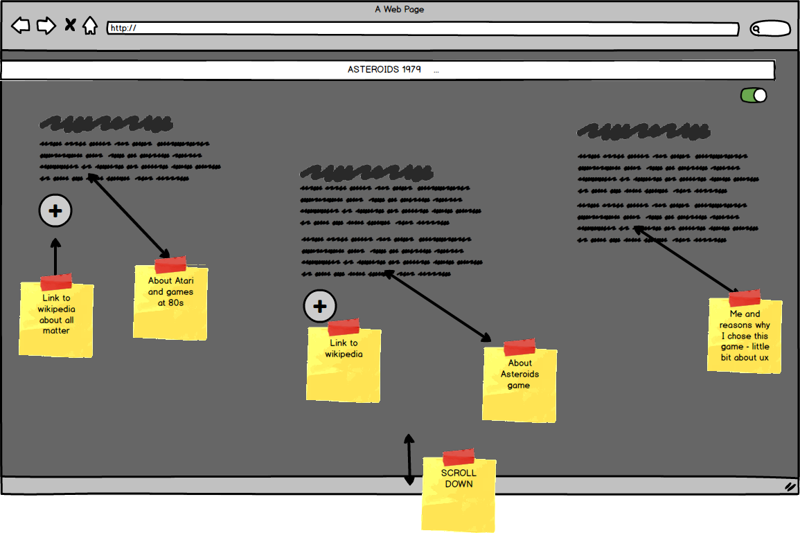
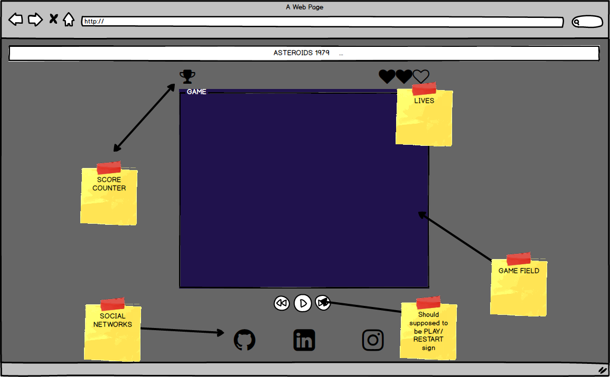
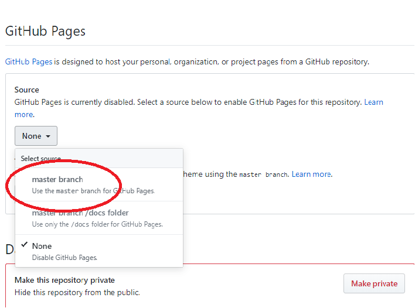

# Asteroids - Game from 1979

Asteroids website is like a back to the past when the Internet was just a newborn and IT just had the first boom! After Atari and Commodore world became different forever! 

<p></p>


## UX

### '80s video games?
My website is prepared to acknowledge the young generation about video games from an era without www.
Most of them never heard of any gaming devices before XBOX and Playstation. '80s are trendy now, so I thought that I could help the new generation to understand how it was.
This website is made as well as a nostalgic journey for those who had a chance to play with Atari games when they were kids.

### Let`s go back!

On my website user can find out a little bit about Atari. there is a text section explaining subject with plus button attached linked to Youtube channel where subject is explained wider.
The same with Asteroids game. On my websiet you can find a short hint but hsitory of a game but attached link to wkipedia saying more about this matter.

### Why Asteroids?
Asteroids is one of my favourite game on Atari, after Tetris and Space Invaders.
Making Asteroids was a big challenge for me but at the same time pleasure to get it done.
Currently im fascinated about '80s era. Music, Film, culture and art. Thats kind of an era that I was a little kid and had impact for my young years. At the begining I wanted to make my website very dark. But things were

Finally my project got colors inspired by my favourite tv show 

* [Stranger Things - Netflix series stylized on '80s](https://www.youtube.com/watch?v=YEG3bmU_WaI)


### User stories

* As Max, I want to have a unique experience and play with oldschool game. so we can enjoy this service together.
* As Anna, I want show my friends a game that I used to play when I was a kid. 
* As a grandma, I want to be able to understand my kids, and explore subject close to their heart. 


## Wireframes


<p></p>

<p></p>


## Features

1. Easy to use- Clear navigation

2. Responsive to different devices media supportive

3. Intuitive - Clear navigation

4. Quality Conent- high resolution photos well made game.

5. Informative - explaining subjet of old videogames

6. User friendly


### Features Left to Implement


## Technologies used

* [Html](https://developer.mozilla.org/en-US/docs/Web/Guide/HTML/HTML5) - Core of the website

* [Css](https://developer.mozilla.org/en-US/docs/Web/CSS) - To make my website stylish

* [Javascript](https://developer.mozilla.org/en-US/docs/Web/JavaScript/Reference) - to make my game with

* [Jquery](https://jquery.com/) - to simplyfy DOM manipulation

* [Bootstrap](https://getbootstrap.com/docs/4.1/getting-started/introduction/) - Framework to make layout and content looking better

* [Fontawesome](https://fontawesome.com/) - Icons to make my website looking proffesional

* [GoogleFonts]( https://fonts.google.com/) - nice choice of fonts

* [Animista](http://animista.net/)  - to animate my icons

* [Mockup](http://ami.responsivedesign.is/#) - mockup for my readme

* [Git](https://git-scm.com/) -version control for my project


## Testing

I have done manual testing:

Hero section:

Asteroids Game plus button: - Try to press button, expected popup modal with text about the game - fully working
Press Play button -Try to press *play* - Try to press button, expected popup modal nested youtube video - fully working

Scrolling up and down on wesite works

Game 

Navigation of the ship when pressed designed button - works
Laser shooting after tapping in space bar - works
Counting points after shooted asteroid - works
Saving best score of a game - works
Loosing lifes after hitted by asteroids -works
I discovered one bug that I cna not fix because of lack of time


Go to the Social Links 

Try to press on Github icon and be redirected to Github opened up with my profile - fully working
Try to press on Instagram icon and be redirected to Instagram page opened up in new tab with my profile - fully working
Try to press on Linkedin icon and be redirected to Linkedin opened up with my profile - fully working
Project is fully responsive on large screens like desktops or laptops and medium size devices as for ex. Pixel 3XL and small phones as iPhone 5s. There is no bugs and website fully works on browsers as Firefox, Opera or Internet Explorer.


## Deployment

#### To deploy my website I had to log on to browser to my personal Gitub account s and click on my repository with Astreoids - Milstone 2 project - that was patrycja-io/asteroids.
#### Onced I clicked my reop I showed a screen with setting and I had to click on this button like above:

<p></p>

#### Than on settings I had to scroll to the end of this page :

<p></p>

#### And find a section with Github Pages and click on source/ none button.
#### Than from toggle menu change it to master branch:

<p></p>

#### After when page refreshed I had a ready url with deployed website:

<p></p>

How to run this project locally
---

1.Under the repository name, click "Clone or download".

2.In the Clone with HTTPs section, copy the clone URL for the repository.

3.In your local IDE open in Terminal.

4.Change the current working directory to the location where you want the cloned directory to be made.

5.Type git clone, and then paste the URL you copied in Step 3.

```

git clone https://github.com/patrycja-io/asteroids
```

Press Enter. Your local clone will be created.


## Credits

**Content**

* [Wikipedia-Asteroids (video game)](https://bit.ly/2PMwBer)
* [liketotally80s](http://www.liketotally80s.com/2006/11/80s-atari/)
* [Main color scheme found on Visme.com  ](https://visme.co/blog/website-color-schemes/)


**Media**
* [Background photo used from Unsplash.com](https://bit.ly/34i6Iaa)
* [Original Asteroids logo](https://upload.wikimedia.org/wikipedia/commons/3/36/Asteroids_arcade_logo.png)


**Acknowledgements**

* [TraversyMedia](https://www.youtube.com/watch?v=vEROU2XtPR8)
* [W3schools](https://www.w3schools.com/tags/ref_canvas.asp)
* [CssTricks](https://css-tricks.com/)
* [StackOverflow](https://stackoverflow.com/)
* [Original game on Youtube](https://www.youtube.com/watch?v=9Ydu8UhIjeU)
