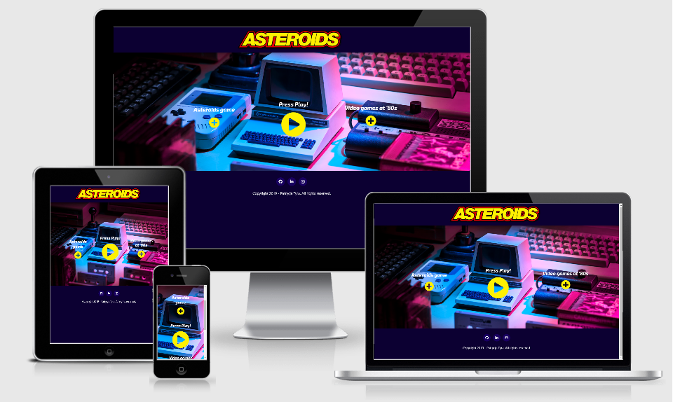

# Asteroids - Game from 1979

Asteroids website is like a back to the past when the Internet was just a newborn and IT just had the first boom! After Atari and Commodore world became different forever! 

## UX

### 80`s video games?
My website is prepared to acknowledge the young generation about video games from an era without www.
Most of them never heard of any gaming devices before XBOX and Playstation. '80s are trendy now, so I thought that I could help the new generation to understand how it was.
This website is made as well as a nostalgic journey for those who had a chance to play with Atari games when they were kids.

### Let`s go back!

On my website user can find out a little bit about Atari. there is a text section explaining subject with plus button attached linked to Youtube channel where subject is explained wider.
The same with Asteroids game. On my websiet you can find a short hint but hsitory of a game but attached link to wkipedia saying more about this matter.

### Why Asteroids?
Asteroids is one of my favourite game on Atari, after Tetris and Space Invaders.
Making Asteroids was a big challenge for me but at the same time pleasure to get it done.
Currently im fascinated about '80s era. Music, Film, culture and art. Thats kind of an era that I was bord and wplyw prominiwal na moje dziecinstwo. At the begining I wanted to make my website very dark. But things were

Finally my project got colors inspired by my favourite tv show 

* [Stranger Things - Netflix series stylized on '80s](https://www.youtube.com/watch?v=YEG3bmU_WaI)

### User stories

### Wireframes

## Features

1.Easy to use- Clear navigation

2.responsive and media supportive

3.Intuitive - Clear navigation

4.Quality Conent

5.Informative

6. user friendly

## Technologies used

* [HTML5](https://developer.mozilla.org/en-US/docs/Web/Guide/HTML/HTML5) - Core of the website

* [CSS3](https://developer.mozilla.org/en-US/docs/Web/CSS) - To make my website stylish

* [JAVASCRIPT](https://developer.mozilla.org/en-US/docs/Web/JavaScript/Reference) - to make my game with

* [JQUERY](https://jquery.com/) - to simplyfy DOM manipulation

* [BOOTSTRAP 4](https://getbootstrap.com/docs/4.1/getting-started/introduction/) - Framework to make layout and content looking better

* [FONTAWESOME](https://fontawesome.com/) - Icons to make my website looking proffesional

* [GOOGLEFONTS]( https://fonts.google.com/) - nice choice of fonts

* [ANIMISTA](http://animista.net/)  - to animate my icons

* [MOCKUP](http://ami.responsivedesign.is/#) - mockup for my readme

* [GIT] (https://git-scm.com/)-version control for my project

## Testing

## Deployment
To Deploy my website I had to logo on browser to my personal gitub side and click on my repository with Milstone 2 project in tghat case that was patrycja-io/asteroids.
Once I cliced on my repo

Pull requests are welcome. For major changes, please open an issue first to discuss what you would like to change.

Please make sure to update tests as appropriate.

## Credits

**Content**

* [Wikipedia-Asteroids (video game)](https://bit.ly/2PMwBer)
http://www.liketotally80s.com/2006/11/80s-atari/
* [Main color scheme taken from - click link ](https://www.awwwards.com/sites/arkade-london-audio-reactive-art)
  `And ` [and found on Visme.com - NO. 9](https://visme.co/blog/website-color-schemes/)

**Media**
* [Background photo used from Unsplash.com](https://bit.ly/34i6Iaa)
* [Original Asteroids logo](https://upload.wikimedia.org/wikipedia/commons/3/36/Asteroids_arcade_logo.png)

**Acknowledgements**

* [Traversy_Media] https://www.youtube.com/watch?v=vEROU2XtPR8
* [w3schools]https://www.w3schools.com/tags/ref_canvas.asp
* [csstricks] https://css-tricks.com/
* [stackoverflow] https://stackoverflow.com/
* [bootstrap_documentation] https://getbootstrap.com/   
* [Original game on Youtube](https://www.youtube.com/watch?v=9Ydu8UhIjeU)
